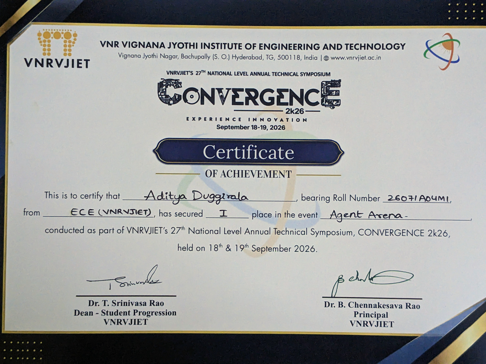
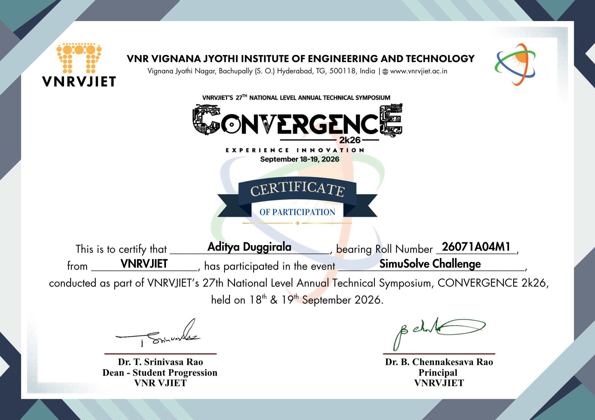

 

## 📌 About Me

<table>
<tr>
<td width="60%" valign="top">

Hello there! I'm **Aditya Duggirala**, an Electronics & Communication Engineering student at VNR Vignana Jyothi Institute of Engineering and Technology. I'm learning fast and turning that learning into shipped products — mostly AI apps built solo, from idea to live link in a weekend.

- 🎓 Studying ECE at **VNRVJIET**, Hyderabad
- 🚀 Solo-building full-stack AI apps with **React**, **Claude API** and **Lovable.dev**
- 🏆 **1st Place — Agent Arena**, CONVERGENCE 2k26 (VNRVJIET's 27th National Symposium)
- 🎖️ Participant, **SimuSolve Challenge**, CONVERGENCE 2k26
- 🩺 Building **Nirogi AI**, a free 12-tool preventive healthcare platform for India
- 🚔 Built **Spectre**, an AI crime-analytics dashboard for the Karnataka State Police
- 💪 Currently building **BeyondHuman**, an AI fitness & health coach

</td>
<td width="40%" valign="top" align="center">

</td>
</tr>
</table>

---

## 🛠️ Technologies

  

---

## 📊 Statistics

 

**Contribution Graph**

---

## 🚀 Live Projects

| | Project | Description | Status |
|:---:|---|---|:---:|
| 💪 | **[BeyondHuman](https://beyondhuman-healthai.lovable.app)** | AI fitness & health coaching platform | 🔨 Building |
| 🏥 | **[Nirogi AI](https://nirogi-healthai.lovable.app)** | 12-tool preventive healthcare platform for India | ✅ Live |
| 🚔 | **[Spectre](https://spectre-crimeai.lovable.app)** | AI crime analytics — KSP Datathon 2026 | ✅ Live |
| 🛒 | **[HyperMart](https://hypermart.lovable.app)** | AI-powered ecommerce platform | ✅ Live |
| 🎵 | **[RemixMusicAI](https://remixmusicai.lovable.app)** | AI music generation & remixing studio | ✅ Live |
| 🎨 | **[DaVinci Canvas AI](https://davinci-canvasai.lovable.app)** | AI image generation & creative canvas | ✅ Live |
| ⚡ | **[Static](https://static-chargepoint.lovable.app)** | India EV & fuel trip planner | ✅ Live |
| 🐞 | **[Bettle](https://bettle-creativeai.lovable.app)** | Social reconnect — schools, colleges, workplaces | ✅ Live |

---

## 📜 Certificates

**🥇 1st Place — Agent Arena** · CONVERGENCE 2k26

  

**🎖️ Participant — SimuSolve Challenge** · CONVERGENCE 2k26

 

