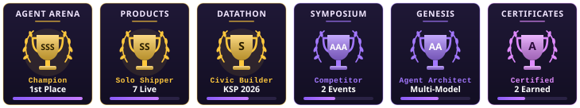

<div align="center">



<br/><br/>

<a href="https://www.linkedin.com/in/aditya-d-aa4635411/"></a>
<a href="https://x.com/iaditya_offical"></a>
<a href="https://github.com/adityalenova/genesis"></a>
<a href="mailto:aditya.duggirala@gmail.com"></a>

<br/><br/>


</div>

<br/>

```
◈ ◈ ◈ ◈ ◈ ◈ ◈ ◈ ◈ ◈ ◈ ◈ ◈ ◈ ◈ ◈ ◈ ◈ ◈ ◈ ◈ ◈ ◈ ◈ ◈ ◈ ◈ ◈ ◈ ◈ ◈ ◈ ◈ ◈ ◈ ◈ ◈ ◈
```

## 🔮 About

I'm an **ECE undergrad at VNR Vignana Jyothi Institute of Engineering and Technology** who builds AI products solo, mostly at night, mostly fast. I route work between Claude, GPT and Gemini depending on what the job actually needs, then trust nothing until it's run for real.

```
◈ ROLE      : SOLO AI BUILDER / ECE UNDERGRAD, VNRVJIET
◈ MODE      : PROTOTYPE → DEPLOY → LISTEN → ITERATE
◈ STACK     : REACT · TYPESCRIPT · SUPABASE · CLAUDE API
◈ BUILDING  : BEYONDHUMAN — AN AI FITNESS & HEALTH COACH
◈ RULE      : DEMO BEATS DECK
```

<br/>

```
◈ ◈ ◈ ◈ ◈ ◈ ◈ ◈ ◈ ◈ ◈ ◈ ◈ ◈ ◈ ◈ ◈ ◈ ◈ ◈ ◈ ◈ ◈ ◈ ◈ ◈ ◈ ◈ ◈ ◈ ◈ ◈ ◈ ◈ ◈ ◈ ◈ ◈
```

## 🧬 Flagship — Genesis

An always-on research loop: it pulls context from prior runs and live literature, routes the next step to the model built for that job, executes it in a sandbox, and logs the full exchange. Nothing closes out until the evidence is checked and a human signs off.

```
◈ CONTEXT      : RETRIEVAL-GROUNDED, PULLED FROM PRIOR RUNS
◈ ROUTING      : LITERATURE → GEMINI · CODE / MATH → OPENAI + SANDBOX
◈ EVIDENCE     : NO CLAIM WITHOUT A LOGGED CITATION
◈ REVIEW GATE  : AN AGENT CAN NEVER CLOSE OUT ITS OWN WORK
```

<div align="center">

**[ [ genesis → ](https://github.com/adityalenova/genesis) ]**

</div>

<br/>

```
◈ ◈ ◈ ◈ ◈ ◈ ◈ ◈ ◈ ◈ ◈ ◈ ◈ ◈ ◈ ◈ ◈ ◈ ◈ ◈ ◈ ◈ ◈ ◈ ◈ ◈ ◈ ◈ ◈ ◈ ◈ ◈ ◈ ◈ ◈ ◈ ◈ ◈
```

## 🖤 Shipped

| | build | the one-line truth | link |
|:---:|---|---|:---:|
| 🏥 | **Nirogi AI** | 12 free preventive-care AI tools, built for every Indian | [open →](https://nirogi-healthai.lovable.app) |
| 🚔 | **Spectre** | Crime-pattern analytics for the Karnataka State Police | [open →](https://spectre-crimeai.lovable.app) |
| 🛒 | **HyperMart** | A storefront where the AI actually knows the inventory | [open →](https://hypermart.lovable.app) |
| 🎵 | **RemixMusicAI** | Remix a track in-browser, no DAW required | [open →](https://remixmusicai.lovable.app) |
| 🎨 | **DaVinci Canvas AI** | A generation canvas for people who can't draw | [open →](https://davinci-canvasai.lovable.app) |
| ⚡ | **Static** | Multi-stop EV & fuel route planning across India | [open →](https://static-chargepoint.lovable.app) |
| 🐞 | **Bettle** | Reconnects you with the schools, colleges & jobs that shaped you | [open →](https://bettle-creativeai.lovable.app) |
| 💪 | **BeyondHuman** | AI fitness & health coach — currently building | 🔨 in progress |

<br/>

```
◈ ◈ ◈ ◈ ◈ ◈ ◈ ◈ ◈ ◈ ◈ ◈ ◈ ◈ ◈ ◈ ◈ ◈ ◈ ◈ ◈ ◈ ◈ ◈ ◈ ◈ ◈ ◈ ◈ ◈ ◈ ◈ ◈ ◈ ◈ ◈ ◈ ◈
```

## 🎨 Stack

<div align="center">


<br/><br/>


</div>

<br/>

```
◈ ◈ ◈ ◈ ◈ ◈ ◈ ◈ ◈ ◈ ◈ ◈ ◈ ◈ ◈ ◈ ◈ ◈ ◈ ◈ ◈ ◈ ◈ ◈ ◈ ◈ ◈ ◈ ◈ ◈ ◈ ◈ ◈ ◈ ◈ ◈ ◈ ◈
```

## 📊 Receipts

<div align="center">


<br/><br/>

**`◈ TROPHY CASE ◈`**



<br/>

**`◈ ACTIVITY ◈`**


<br/>

**`◈ CONTRIBUTION SNAKE ◈`**


</div>

<br/>

```
◈ ◈ ◈ ◈ ◈ ◈ ◈ ◈ ◈ ◈ ◈ ◈ ◈ ◈ ◈ ◈ ◈ ◈ ◈ ◈ ◈ ◈ ◈ ◈ ◈ ◈ ◈ ◈ ◈ ◈ ◈ ◈ ◈ ◈ ◈ ◈ ◈ ◈
```

## 🏆 Proof of Work

<table width="100%">
<tr>
<td width="50%" align="center">

**🥇 1st Place — Agent Arena**
<sub>CONVERGENCE 2k26 · VNRVJIET's 27th National Symposium · 18–19 Sept 2026</sub>


</td>
<td width="50%" align="center">

**🎖️ Participant — SimuSolve Challenge**
<sub>CONVERGENCE 2k26 · VNRVJIET's 27th National Symposium · 18–19 Sept 2026</sub>


</td>
</tr>
</table>

<br/>

```
◈ ◈ ◈ ◈ ◈ ◈ ◈ ◈ ◈ ◈ ◈ ◈ ◈ ◈ ◈ ◈ ◈ ◈ ◈ ◈ ◈ ◈ ◈ ◈ ◈ ◈ ◈ ◈ ◈ ◈ ◈ ◈ ◈ ◈ ◈ ◈ ◈ ◈
```

<div align="center">

### 🖤 End Transmission — Or Start a Conversation

*"Ship fast. Learn faster. Verify everything."*

<a href="https://www.linkedin.com/in/aditya-d-aa4635411/"></a>
<a href="https://x.com/iaditya_offical"></a>
<a href="mailto:aditya.duggirala@gmail.com"></a>

```
[ exit 0 ] ◈
```

</div>
